OfficeHarbor (OH) is a **desktop app for managing the contacts of a tech firm's teams, optimized for use via a Command Line Interface** (CLI) while still having the benefits of a Graphical User Interface (GUI). If you can type fast, OH can get your contact management tasks done faster than traditional GUI apps.

* Table of Contents
{:toc}

--------------------------------------------------------------------------------------------------------------------

## Quick start

1. Ensure you have Java `11` or above installed in your Computer.

2. Download the latest `OfficeHarbor.jar` from
   [here](https://github.com/AY2324S2-CS2103T-W13-2/tp/releases/latest).

3. Copy the file to the folder you want to use as the _home folder_ for your OH.

4. (a) Double-click on the `officeharbor.jar` file to run the application.
   (b) (Or) Open a command terminal, `cd` into the folder you put the jar file in, and use the `java -jar officeharbor.jar` command to run the application. 
   A GUI similar to the below should appear in a few seconds. Note how the app contains some sample data. 
   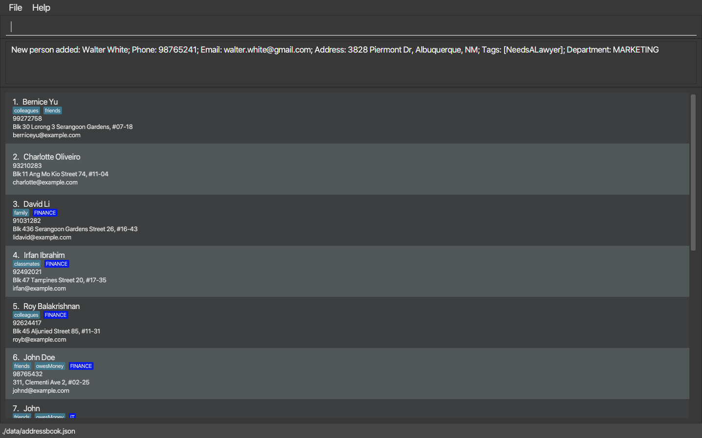

5. Type the command in the command box and press Enter to execute it. e.g. typing **`help`** and pressing **| Enter &#9166; |** will open the help window. 
   Some example commands you can try:

   * `list` : Lists all contacts.

   * `add name:John Doe phone:98765432 email:johnd@example.com address:John street, block 123, #01-01` : Adds a contact named `John Doe` to OH.

   * `delete 3` : Deletes the 3rd contact shown in the current list.

   * `clear` : Deletes all contacts.

   * `exit` : Exits the app.

6. Refer to the [Features](#features) below for details of each command.

--------------------------------------------------------------------------------------------------------------------

## Features

**:information_source: Notes about the command format:** 

* Words :warning: enclosed between diamond brackets `<>`, are the parameters to be supplied by the user. 
  e.g. in `add name:<name>`, `<name>` is a parameter which can be used as `add name:John Doe`.

* Space can be added between the prefix and the word. 
  e.g. either `name: <name> phone: <phone number>` or `name:<name> phone:<phone number>` is acceptable.

* Any component of a command surrounded in `[]` are optional. 
  e.g. the command (`add`)[#adding-a-person-add] has an optional
  `[department:<department>]` field, so it can be invoked with or without a
  department.

* Any component with `...` after it means that it can be specified multiple times after the first one.
  e.g. In [`delete`](#deleting-a-person--delete), `<id>...` means that at least one id should be specified. In [`tag`](#tagging-a-contact--tag), `[tag:<tag>]...` means that zero or more tags should be specified.

* The input fields for a command can be in any order. 
  e.g. if the command specifies `name:<name> phone:<phone number>`, `phone:<phone number> name:<name>` is also acceptable.

* Extraneous parameters for commands that do not take in parameters (such as `help`, `list`, `exit` and `clear`) will be ignored. 
  e.g. if the command specifies `help 123`, it will be interpreted as `help`.

* If you are using a PDF version of this document, be careful when copying and pasting commands that span multiple lines as space characters surrounding line-breaks may be omitted when copied over to the application.

### Viewing help : `help`

Shows either a general summary of the available command or a more detail help message for the input command if there is 
any. All help window also has a url link at the bottom.

Format: `help [command]`

`command` is optional and is where you input the command that you want to know about.

Examples:
* `help`
* `help add`

Output:

The message "Opened help window" in the output box, along with a separate window will be shown.

*help command without input command*
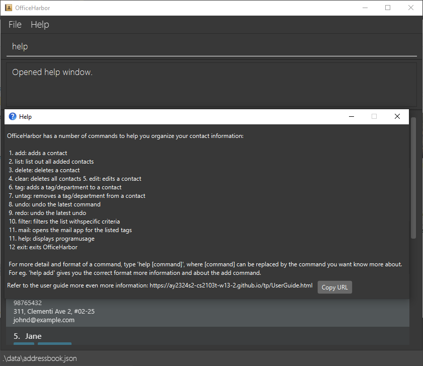
*help command for `add` command*
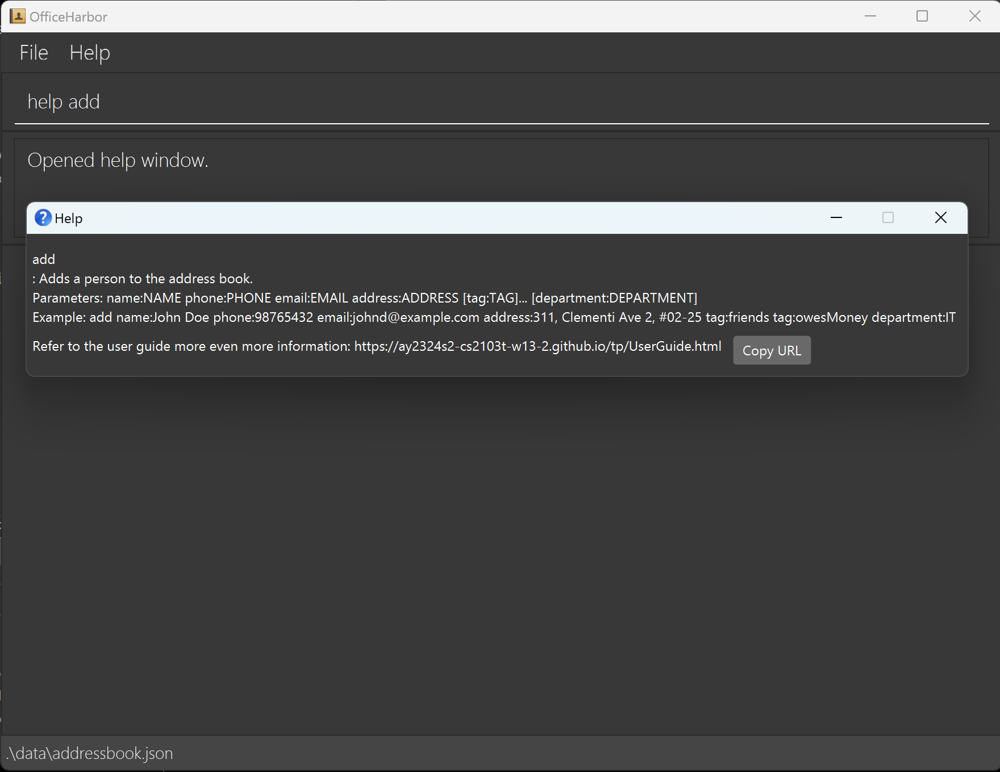

### Adding a person: `add`

Adds a contact with the input details to OH.

Format: `add name:<name> phone:<phone number> email:<email address> address:<address> [tag:<tag>]... [department:<department>]`

Examples:
* `add name:John Doe phone:98765432 email:johnd@example.com address:John street, block 123, #01-01`
* `add name:Virat Kohli phone:98765432 email:virat@gmail.com address:Altamount Road, block 10, #05-02`

Output:
The message “A new contact `name` has been added to the list. Name: `<name>`, Phone: `<phone number>`, Email: `<email>`, Address: `<address>`.” will be shown. 
A new contact entry with the given user will be displayed in the list.

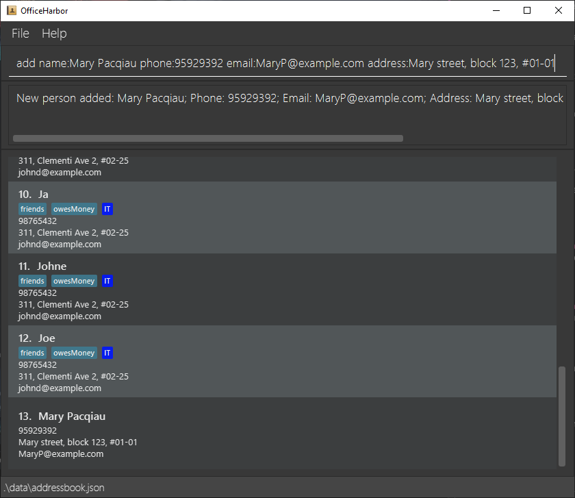

### Listing all persons : `list`

Shows a list of all contacts in OH.

Format: `list`

Output:
A list of added contacts if any in the form of a scrollable pane will be shown. 
The contacts are listed in the order in which they are added.
The message "Empty list" is shown when there is nothing added.

### Deleting a person : `delete`

Deletes the specified contact(s) from OH.

Format: `delete <id>...`

* Deletes the person at the specified `<id> ...`.
* The id refers to the index number shown in the contact list.
* The id **must be a positive integer** 1, 2, 3, …​

Examples:
* `delete 2 3` deletes the 2nd and 3rd person of the contact list from OH.

Output:
The message "Contact `name` has been deleted. Name: `name`, Phone: `phone number`, Email: `email`, Address: `address`.” will be shown.
The entry with the given id will disappear from the list.

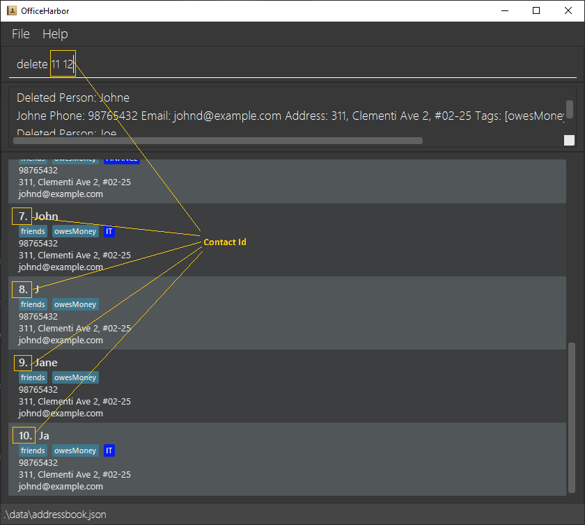

### Clearing all entries : `clear`

Clears all entries from OH.

Format: `clear`

Output:
The message "Address book has been cleared!" will be shown.

### Tagging a Contact : `tag`

Tags the specified contact with the input tag name and/or input department name.

* Tags the person(s) at the specified `<id>...`.
* The id refers to the index number(s) shown in the displayed person list.
* The id **must be a positive integer** 1, 2, 3, …

Format: `tag <id>... tag:<tag>... [tag:<tag>]... [department:<department>]`

**:information_source: Note:** 
There must be at least the department specified or at least one tag. The command
cannot only have an id.

Example:
`tag 2 3 tag: colleagues`, `tag 2 3 department: FINANCE`, `tag 2 3 tag: colleagues department: FINANCE`

Output:
The message "Tagged Contacts: `contact index` with `tag name` and/or `department name`.” will be shown, 
where contact index is the number representing where the current contact is
on the currently displayed list.

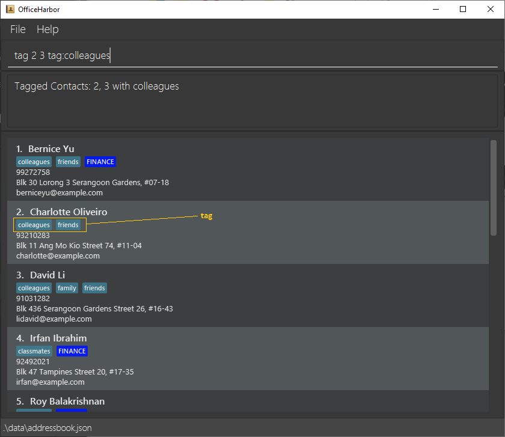
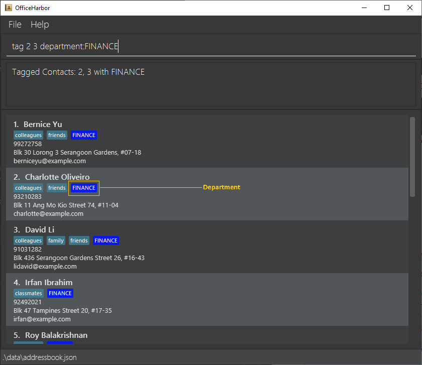

### Deleting a tag : `untag`

Deletes the specified tag from the specified contact

* Delete the specified tag of the person at the specified `<id>`.
* The id refers to the index number shown in the displayed person list.
* The id **must be a positive integer** 1, 2, 3, …
* All the specified tags and the department (if specified) must match the ones
  stored in the id.

Format: `untag <id> [tag:<tag>]... [department:<department>]`

**:information_source: Note:** 
`untag` currently doesn't support multiple `<id>` like `tag` and `delete`. It is
planned for a future release.

Output:
The message "The tag `<tag>` has been removed from contact: `contact info`." will be shown,
where contact info is all the information of the contact. 
The list entry of the user with <id> will not have the tag anymore.

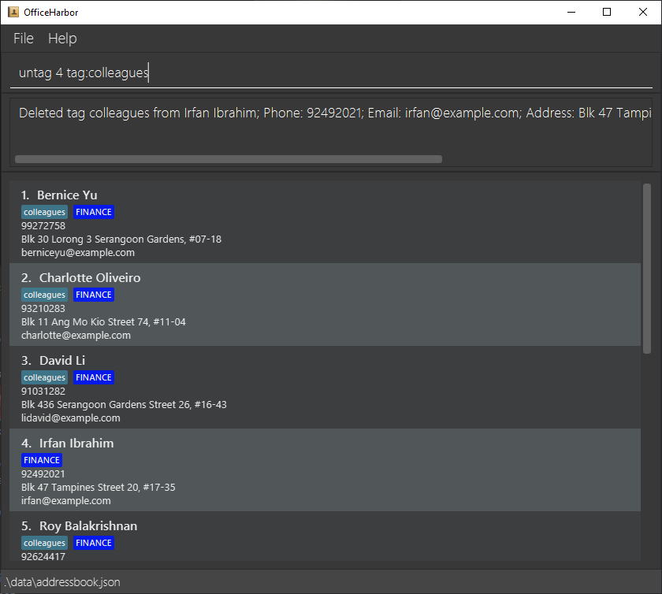

### Filtering contacts : filter

Filters the contacts.

Format: `filter <component>[.<modifier>]:<value> ...`

`component` is one of `name`, `phone`, `email`, `department`, or `address` corresponding to the values in add:
name, phone, email and address respectively.

There can be duplicate components, if there are multiple components, the
contacts that match any of the components are shown.

In order to filter with values that must all match, the only way to do so right
now is to run the filter command multiple times. The first command filters the
whole list, the second command filters the previous filtered list, and so on.

`modifier` is to specify how the filtering should be done, it is optional and
defaults to `has`. The components are
- `has`: value has to match part of the component
- `hasnt`: negation of has
- `is`: value has to match the component exactly
- `isnt`: negation of is
- `word`: value has to match a distinct word in the component, a word is any
sequence of letters and numbers surrounded by spaces
- `noword`: negation of word

Example
`filter address:serangoon`
> The default modifier is `has`, so this lists every contact with an address that
> has queenstown in it.

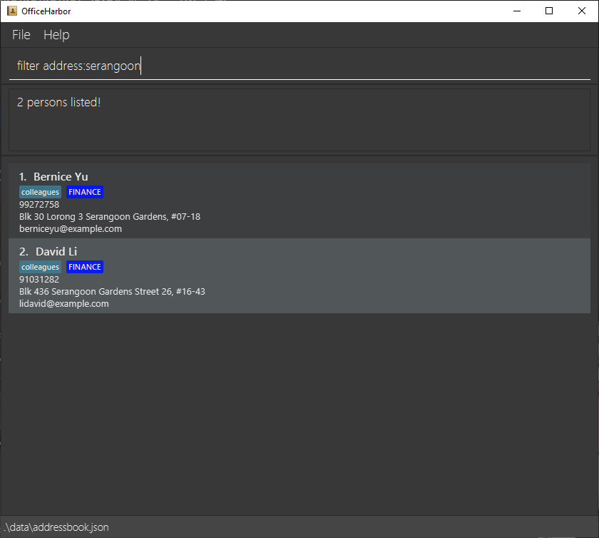

`filter phone.is:93210283`
> Returns the contact with the phone number 93210283

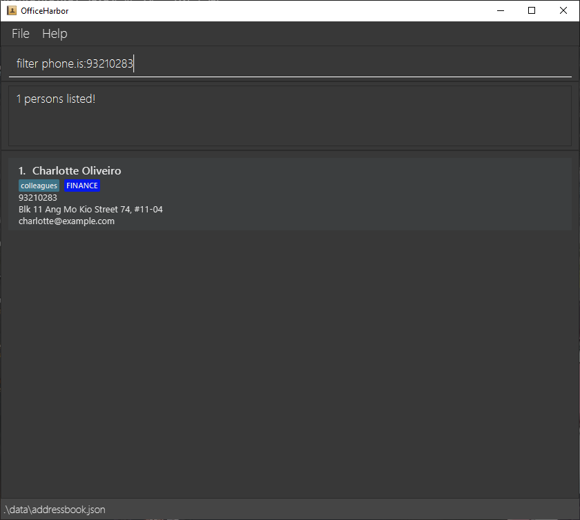

Output:
If 10 contacts match the list, the output message is "10 persons listed"

### Undoing a command : `undo`

Resets the state of OH to before the execution of the latest command.

**:information_source: Note:** 
OfficeHarbor can undo up to 5 times, and only commands run from the command's
startup. We recommend you to keep regular backups of your [data](#the-data-file) in case you want
to change something you did beforehand.

Format: `undo`

Output:
The message "Undo success!" will be shown. 
The list entry of the user will return to the state before the latest command. 
If no command has been run at all, an error message "No more commands to undo!" will be shown instead.

Example of undoing a delete command.

Contact after a delete command:
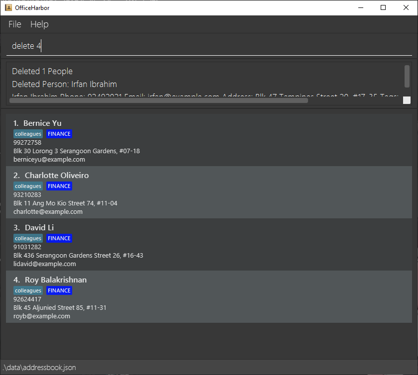

Contact after the delete command is undone:
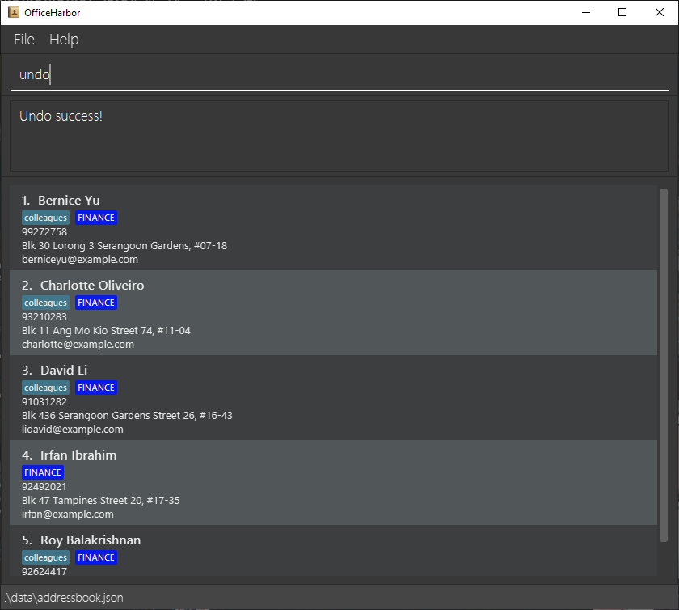

### Redoing a command : `redo`

Resets the state of OH to before the latest undo command.

Format: `redo`

Output:
The message "Redo success!" will be shown.
The list entry of the user will return to the state before the latest undo command.
If no undo command has been run at all, an error message "No more commands to redo!" will be shown instead.

Example of redoing the previous undo command:
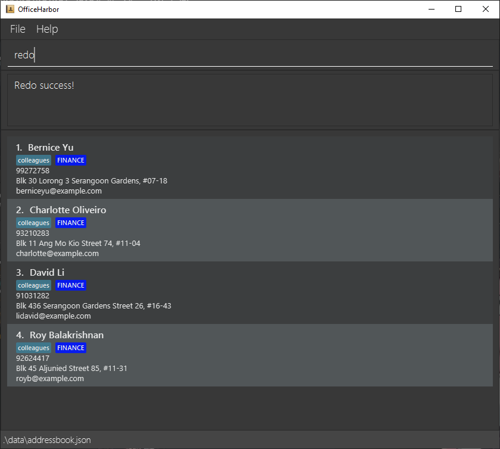\

### Mailing to a list of people : `mail`

Composes an email to the people tagged with the selected tag.

Format: `mail <tag>`

Output: The message "Here is the list of emails:
`email1`,`email2`,`email3`..." will be shown, where `email1` is the
email of the first person currently displayed in the contact list.
Additionally, the system default mailing app will open and a mail will
be drafted. The recipients field will be automatically filled up with
the emails shown earlier.

Example of mail command: `mail colleagues`
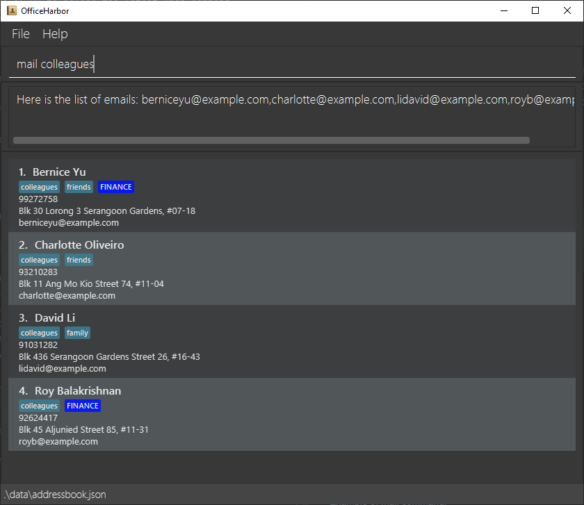
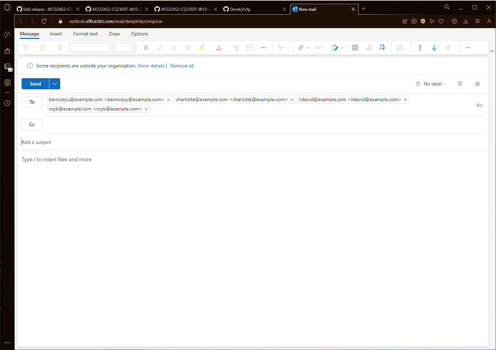

**:information_source: Note:** 
If the command does not do anything, it might be that you do not have a default mail app set up.

Here is how to do so for Windows and Mac:
https://www.lessannoyingcrm.com/help/setting-your-computers-default-email-program

### Copying phone numbers : `phone`

Copies the phone numbers of people tagged with the selected tag to
your clipboard for ease of messaging.

Format: `phone <tag>`

Output: The message "Here is the list of phone numbers: 
`phone1`,`phone2`,`phone3`...

They have been copied to your clipboard."

Example of phone command: `phone colleague`
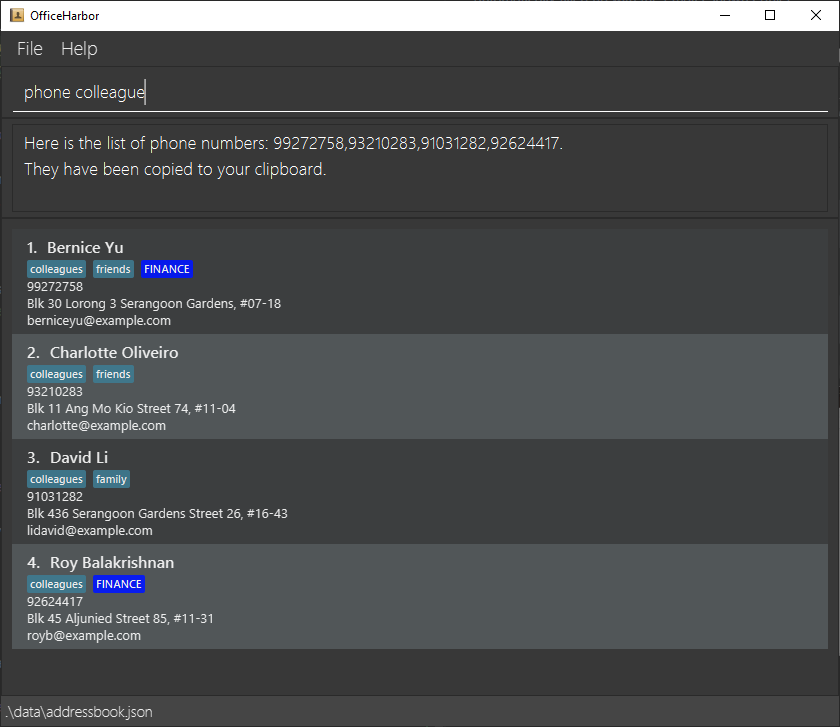

### Exiting the program : `exit`

Exits the program.

Format: `exit`

### Saving the data

OfficeHarbor data are saved in the hard disk automatically after any command that changes the data. There is no need to save manually.

### The data file

OfficeHarbor data are saved automatically as a JSON file `[JAR file location]/dataddress:officeharbor.json`. Advanced users are welcome to update data directly by editing that data file.

:exclamation: **Caution:**
If your changes to the data file makes its format invalid, OfficeHarbor will discard all data and start with an empty data file at the next run. Hence, it is recommended to take a backup of the file before editing it. 
Furthermore, certain edits can cause the OfficeHarbor to behave in unexpected ways (e.g., if a value entered is outside the acceptable range). Therefore, edit the data file only if you are confident that you can update it correctly.

--------------------------------------------------------------------------------------------------------------------

## FAQ

**Q**: How do I transfer my data to another Computer? 
**A**: Install the app in the other computer and overwrite the empty data file it creates with the file that contains the data of your previous OfficeHarbor home folder.

--------------------------------------------------------------------------------------------------------------------

## Known issues :warning:

1. **When using multiple screens**, if you move the application to a secondary screen, and later switch to using only the primary screen, the GUI will open off-screen. The remedy is to delete the `preferences.json` file created by the application before running the application again.

--------------------------------------------------------------------------------------------------------------------

## Command summary

| Action         | Format, Examples                                                                                                                                                                         |
|----------------|------------------------------------------------------------------------------------------------------------------------------------------------------------------------------------------|
| **Add**        | `add name:<name> phone:<phone number> email:<email address> address:<address> [tag:tag]... [department:<department>]`   e.g., `add name:James Ho phone:22224444 email:jamesho@example.com address:123, Clementi Rd, 1234665 tag:Friend department:Marketing` |
| **Delete**     | `delete <id>`  e.g., `delete 3`                                                                                                                                                       |
| **Clear**      | `clear`                                                                                                                                                                                  |
| **Tag**        | `tag <id> [tag:<tag>]... [department:<department>]`    e.g., `tag 2 tag:friends department:HR`                                                                                                                        |
| **Delete Tag** | `untag <id> [tag:<tag>]... [department:<department>]`   e.g., `untag 2 tag:friends department:HR`                                                                                                                     |
| **List**       | `list`                                                                                                                                                                                   |
| **Undo**       | `undo`                                                                                                                                                                                   |
| **Redo**       | `redo`                                                                                                                                                                                   |
| **Help**       | `help`                                                                                                                                                                                   |
| **Mail**       | `mail <tag>`
| **Phone**      | `phone <tag>`
