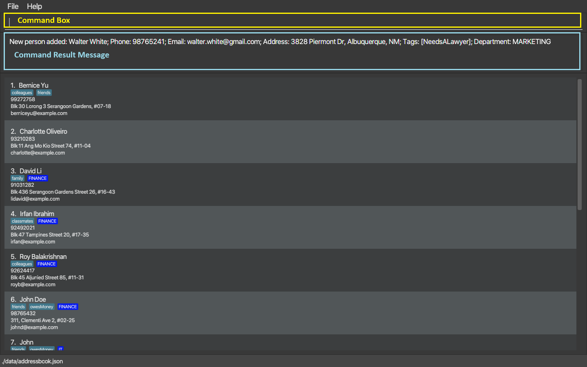
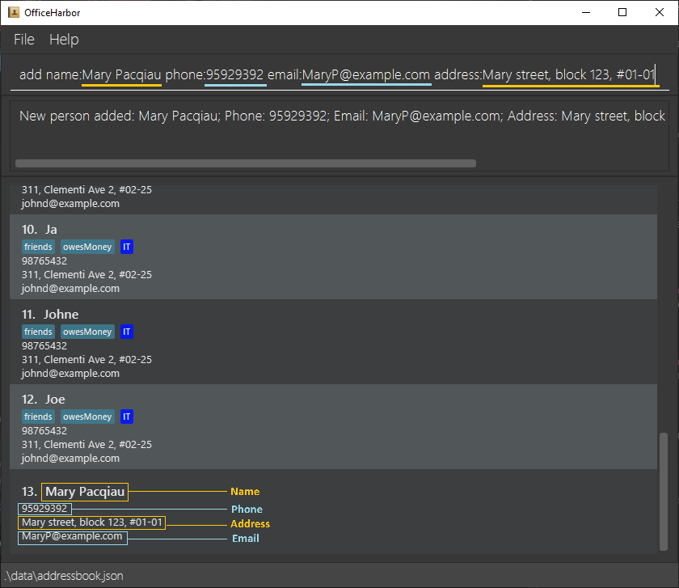

# Welcome Message

Welcome to the user guide of OfficeHarbor (OH). OH is a desktop app designed to assist secretaries of large teach firms in
efficiently managing the contacts of the tech teams. The app is optimized primarily for keyboard use, allowing for a fast 
workflow. Additionally, it also has a dynamic on-screen feedback to keep the users informed of their operation throughout 
the interaction. If you can type fast, OH can get your contact management tasks done faster than traditional mouse-based apps.

## Target Audience

The user guide is mainly intended for secretaries of a large tech firm. We assumed that they will have some experience in
typing but is unfamiliar with **Command Line Interface (CLI)** and other technical details. 

## Purpose of this Guide

The primary purpose of the user guide is to quickly help novice users to familiarize with the keyboard-based environment 
and learn how to use the basic function of the app. The secondary purpose is to provide a fast way for the experienced users
to find the app information that they are looking for.

## Navigating the guide

For quickly finding the information that you are looking, you can make use of the [Table of Contents](#table-of-contents) 
below, which has a list of all the information, by clicking on the items, you will be directly to the content that you just clicked.

Throughout the guide, there are also some icons which represents information outside just technicalities.

* :bulb: **Tip**: This icon indicates a tip, suggestion, or piece of advice to help you use OH more effectively.

* :page_facing_up: **Note**: This icon tells you about some details of the app usage that you could missed out on.

* :warning: **Warning**: This icon alerts you about potential issues that you may face when using the app.

* :star: **Benefit**: This icon signifies the benefits and relevance of the above OH feature.

When reading through the guide, you can look for these icons for extra information.

*The usage of these special icons are inspired by section 1.4 of the user guide for the app SweetRewards [link](https://ay2324s2-cs2103t-t13-4.github.io/tp/UserGuide.html#14-navigating-this-guide)*

--------------------------------------------------------------------------------------------------------------------

# Table of Contents
  {:toc}

# 1. Getting started

1. Ensure you have Java `11` or above installed in your Computer.

2. Download the latest `OfficeHarbor.jar` from
   [here](https://github.com/AY2324S2-CS2103T-W13-2/tp/releases/latest).

3. Copy the file to the folder you want to store and use your OH.

4. Double-click on the `officeharbor.jar` file to run the application.
   An app similar to the below image should appear in a few seconds. Note how the app contains some sample data. 
   

5. Type the command in the command box and press Enter to execute it. e.g. typing **`help`** and pressing **| Enter &#9166; |** will open the help window. 
   Some example commands you can try:

    * `list` : Lists all contacts.

    * `add name:John Doe phone:98765432 email:johnd@example.com address:John street, block 123, #01-01` : Adds a contact named `John Doe` to OH.

    * `delete 3` : Deletes the 3rd contact shown in the current list.

    * `clear` : Deletes all contacts.

    * `exit` : Exits the app.

6. Refer to the [Features](#2-features) below for details of each command.

# 2. Features

**:information_source: Notes about the command format:** 

* Words enclosed between diamond brackets `<>`, are the information to be entered by the user. 
  e.g. in `add name:<name>`, `<name>` is which you enter the name information, so `add name:John Doe`, will enter exactly
  `John Doe` as the name, including the space in between.

* Space can be added between the keyword and the word in `<>` bracket. 
  e.g. either `name: <name> phone: <phone number>` or `name:<name> phone:<phone number>` is acceptable.

* Any part of a command surrounded in `[]` bracket are optional. 
  e.g. the command [`add`](#22-adding-a-person--add) has an optional `[department:<department>]` part, so it can be 
  executed with or without a department.

* Any part of a command with `...` after it means that it can be specified multiple times after the first one.
  e.g. In [`delete`](#24-deleting-a-person--delete), `<id>...` means that more ids can be entered after the first one.

* The required part of a command can be in any order. 
  e.g. if the command needs `name:<name> phone:<phone number>`, `phone:<phone number> name:<name>` is also acceptable.

* Extra parameters for commands that do not take in parameters (such as [`list`](#23-listing-all-persons--list), 
  [`exit`](#213-exiting-the-program--exit) and [`clear`](#25-clearing-all-entries--clear)) will be ignored. 
  e.g. if the command specifies `list 123`, it will be interpreted as `list`.

* If you are using a PDF version of this document, be careful when copying and pasting commands that span multiple lines 
  as space characters surrounding line-breaks may be omitted when copied over to the application.

## 2.1 Viewing help : `help`

Shows either a general summary of the available command or a more detailed help message for the entered command if there is 
any. All help window also has a url link to the user guide at the bottom.

Format: `help [command]`

Examples:
* `help`
* `help add`

Output:

The message "Opened help window" in the output box. A separate help window will also be shown.

*help command without input command*

*help command for `add` command*

## 2.2 Adding a person: `add`

Adds a contact with the input details to OH.

Format: `add name:<name> phone:<phone number> email:<email address> address:<address> [tag:<tag>]... [department:<department>]`

Examples:
* `add name:John Doe phone:98765432 email:johnd@example.com address:John street, block 123, #01-01`
* `add name:Virat Kohli phone:98765432 email:virat@gmail.com address:Altamount Road, block 10, #05-02`

Output:
The message “A new contact `<name>` has been added to the list. Name: `<name>`, Phone: `<phone number>`, Email: `<email>`, Address: `<address>`.” will be shown. 
A new contact entry with the given user will be displayed in the list.

:bulb: **Tip**: You can add the contact of a certain employee directly with tags and department with the `add` command.

:bulb: **Tip**: Notice how the tag details are specified as `[tag:<tag>]...`, this means that more tags can be entered
the first one, but since the first tag is in `[]` brackets, it will be optional and it meant that the add command accepts 
zero or more tags.

## 2.3 Listing all persons : `list`

Shows a list of all contacts in OH.

Format: `list`

Output:
A list of added contacts if any in the form of a scrollable pane will be shown. 
The contacts are listed in the order in which they are added.
The message "Listed all contacts" is shown in the message box if there is any contact, or else the message is
"The list is empty".

## 2.4 Deleting a person : `delete`

Deletes the specified contact(s) from OH.

Format: `delete <id>...`

* Deletes the person at the specified `<id> ...`.
* The id refers to the index number shown in the contact list.
* The id **must be a positive integer** 1, 2, 3, …​

Examples:
* `delete 2 3` deletes the 2nd and 3rd person of the contact list from OH.

Output:
The message "Contact `name` has been deleted. Name: `name`, Phone: `phone number`, Email: `email`, Address: `address`.” will be shown.
The entry with the given id will disappear from the list.

:warning: **Warning**: Due to a problem in the app, try not to delete duplicate contact, for e.g. `delete 1 1`, the specified 
contact will be deleted, but there will be no output message, and you will not be able to undo the deletion. 

## 2.5 Clearing all entries : `clear`

Clears all entries from OH.

Format: `clear`

Output:
The message "Address book has been cleared!" will be shown.

## 2.6 Tagging a Contact : `tag`

Tags the specified contact with the input tag name and/or input department name.

* Tags the person(s) at the specified `<id>...`.
* The id refers to the index number(s) shown in the displayed person list.
* The id **must be a positive integer** 1, 2, 3, …

Format: `tag <id>... tag:<tag>... [tag:<tag>]... [department:<department>]`

**:information_source: Note:** 
There must be at least the department specified or at least one tag. The command
cannot only have an id.

Example:
`tag 2 3 tag: colleagues`, `tag 2 3 department: FINANCE`, `tag 2 3 tag: colleagues department: FINANCE`

Output:
The message "Tagged Contacts: `contact index` with `tag name` and/or `department name`.” will be shown, 
where contact index is the number representing where the current contact is
on the currently displayed list.

## 2.7 Deleting a tag : `untag`

Deletes the specified tag from the specified contact

* Delete the specified tag of the person at the specified `<id>`.
* The id refers to the index number shown in the displayed person list.
* The id **must be a positive integer** 1, 2, 3, …
* All the specified tags and the department (if specified) must match the ones
  stored in the id.

Format: `untag <id> [tag:<tag>]... [department:<department>]`

**:information_source: Note:** 
`untag` currently doesn't support multiple `<id>` like `tag` and `delete`. It is
planned for a future release.

Output:
The message "The tag `<tag>` has been removed from contact: `contact info`." will be shown,
where contact info is all the information of the contact. 
The list entry of the user with <id> will not have the tag anymore.

## 2.8 Filtering contacts : `filter`

Filters the contacts.

Format: `filter <component>[.<modifier>]:<value> ...`

`component` is one of `name`, `phone`, `email`, `department`, or `address` corresponding to the values in add:
name, phone, email and address respectively.

There can be duplicate components, if there are multiple components, the
contacts that match any of the components are shown.

`modifier` is to specify how the filtering should be done, it is optional and
defaults to `has`. The components are
- `has`: value has to match part of the component
- `hasnt`: negation of has
- `is`: value has to match the component exactly
- `isnt`: negation of is
- `word`: value has to match a distinct word in the component, a word is any
sequence of letters and numbers surrounded by spaces
- `noword`: negation of word

Example
`filter address:serangoon`
> The default modifier is `has`, so this lists every contact with an address that
> has queenstown in it.

`filter phone.is:93210283`
> Returns the contact with the phone number 93210283

Output:
If 10 contacts match the list, the output message is "10 persons listed"

## 2.9 Mailing to a list of people : `mail`

Composes an email to the people tagged with the selected tag.

Format: `mail <tag>`

Output: The message "Here is the list of emails:
`email1`,`email2`,`email3`..." will be shown, where `email1` is the
email of the first person currently displayed in the contact list.
Additionally, the system default mailing app will open and a mail will
be drafted. The recipients field will be automatically filled up with
the emails shown earlier.

Example of mail command: `mail colleagues`

## 2.10 Copying phone numbers : `phone`

Copies the phone numbers of people tagged with the selected tag to
your clipboard.

Format: `phone <tag>`

Output: The message "Here is the list of phone numbers:
`phone1`,`phone2`,`phone3`...

They have been copied to your clipboard."

Example of phone command: `phone colleague`

## 2.11 Undoing a command : `undo`

Resets the state of OH to before the execution of the latest command.
However, the undo command does not work for closing and then relaunching the app.
All commands except 'filter' can be undone.

**:information_source: Note:** 
OfficeHarbor can undo up to 5 times, and only commands run from the command's
startup. We recommend you to keep regular backups of your [data](#the-data-file) in case you want
to change something you did beforehand.

Format: `undo`

Output:
The message "Undo success!" will be shown. 
The list entry of the user will return to the state before the latest command. 
If no command has been run at all, an error message "No more commands to undo!" will be shown instead.

Example of undoing a delete command.

Contact after a delete command:

Contact after the delete command is undone:

## 2.12 Redoing a command : `redo`

Resets the state of OH to before the latest undo command.
However, the redo command does not work for closing and then relaunching the app.
All commands except 'filter' can be redone.

Format: `redo`

Output:
The message "Redo success!" will be shown.
The list entry of the user will return to the state before the latest undo command.
If no undo command has been run at all, an error message "No more commands to redo!" will be shown instead.

Example of redoing the previous undo command:

## 2.13 Exiting the program : `exit`

Exits the program.

Format: `exit`

## 2.14 Saving the data

OfficeHarbor data are saved in the hard disk automatically after any command that changes the data. There is no need to save manually.

### The data file

OfficeHarbor data are saved automatically as a JSON file `[JAR file location]/dataddress:officeharbor.json`. Advanced users are welcome to update data directly by editing that data file.

:exclamation: **Caution:**
If your changes to the data file makes its format invalid, OfficeHarbor will discard all data and start with an empty data file at the next run. Hence, it is recommended to take a backup of the file before editing it. 
Furthermore, certain edits can cause the OfficeHarbor to behave in unexpected ways (e.g., if a value entered is outside the acceptable range). Therefore, edit the data file only if you are confident that you can update it correctly.

--------------------------------------------------------------------------------------------------------------------

## FAQ

**Q**: How do I transfer my data to another Computer? 
**A**: Install the app in the other computer and overwrite the empty data file it creates with the file that contains the data of your previous OfficeHarbor home folder.

--------------------------------------------------------------------------------------------------------------------

## Other Known issues :warning:

1. **When using multiple screens**, if you move the application to a secondary screen, and later switch to using only the primary screen, the GUI will open off-screen. The remedy is to delete the `preferences.json` file created by the application before running the application again.

--------------------------------------------------------------------------------------------------------------------

## Command summary

| Action         | Format, Examples                                                                                                                                                                                                                                                  |
|----------------|-------------------------------------------------------------------------------------------------------------------------------------------------------------------------------------------------------------------------------------------------------------------|
| **Add**        | `add name:<name> phone:<phone number> email:<email address> address:<address> [tag:<tag>]... [department:<department>]`   e.g., `add name:James Ho phone:22224444 email:jamesho@example.com address:123, Clementi Rd, 1234665 tag:Friend department:Marketing` |
| **Clear**      | `clear`                                                                                                                                                                                                                                                           |
| **Delete**     | `delete <id>`  e.g., `delete 3`                                                                                                                                                                                                                                |
| **Delete Tag** | `untag <id> [tag:<tag>]... [department:<department>]`   e.g., `untag 2 tag:friends department:HR`                                                                                                                                                              |
| **Exit**       | `exit`                                                                                                                                                                                                                                                            |
| **Filter**     | `filter <component>[.<modifier>]:<value> `   e.g., `filter name.has: Alex`                                                                                                                                                                                     |
| **Help**       | `help`                                                                                                                                                                                                                                                            |
| **List**       | `list`                                                                                                                                                                                                                                                            |
| **Mail**       | `mail <tag>`                                                                                                                                                                                                                                                      |
| **Phone**      | `phone <tag>`                                                                                                                                                                                                                                                     |
| **Redo**       | `redo`                                                                                                                                                                                                                                                            |
| **Tag**        | `tag <id> [tag:<tag>]... [department:<department>]`    e.g., `tag 2 tag:friends department:HR`                                                                                                                                                                 |
| **Undo**       | `undo`                                                                                                                                                                                                                                                            |
